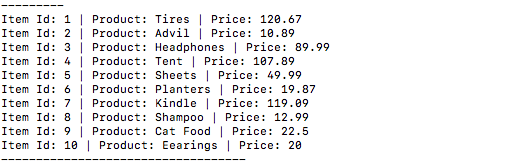

# Bamazon App . 
 
Welcome to Bamazon! This application will allow customer to shop at your online store.
 
After connecting to the databse, the customer will be shown a list of the products available:
 

 
Your customer will be asked to choose the ID of the product they want to buy from the list, and how many units they want to purchase:
 
IMAGE
 
Once a selection is made, the app will print out the customer's 'receipt' with the product name, quantity, unit price, and the total charge:
 
IMAGE
 
If there is not enough inventory available to fill the order, they will receive a warning:
 
IMAGE

